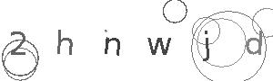

# simple-captcha-solver
Project to solve simple captchas like: 



To solve captcha it was used simple OpenCV commands: 

The first step is convert the image to Gray scale, then apply some simple [gaussian blur](https://en.wikipedia.org/wiki/Gaussian_blur) and calculate the [OTSU´s threshold](https://en.wikipedia.org/wiki/Otsu%27s_method):

```python
gray = cv2.cvtColor(image, cv2.COLOR_BGR2GRAY)
blur = cv2.GaussianBlur(gray, (3,3), 0)
thresh = cv2.threshold(blur, 0, 255, cv2.THRESH_BINARY_INV + cv2.THRESH_OTSU)[1]
```

The blur method removes first noises then Otsu´s threshold only selects the most relevant part of the image.

Then we can apply some simple [morphologic operations](https://www.geeksforgeeks.org/python-opencv-morphological-operations/) based on Otsu´s thresholds result to remove more noises and keep only the featured information.

```python
kernel = cv2.getStructuringElement(cv2.MORPH_RECT, (3,3))
opening = cv2.morphologyEx(thresh, cv2.MORPH_OPEN, kernel, iterations=1)
```

After that to simplify the tesseract OCR proccess, we invert the image, and run the OCR command passing the characters whitelist:

```python
invert = 255 - opening
solved = pytesseract.image_to_string(invert, lang='eng', config='--psm 6 -c tessedit_char_whitelist=0123456789abcdefghijklmnopqrstuvwxyz')
```
---
If you want to run the latest builded docker you can pull from GitHub Container Registry:

```sh
docker pull ghcr.io/andriow/simple_captcha_solver:latest
```

To build container with all requirements:

```sh
docker build -t simple_captcha_solver:latest . --no-cache
```

To run the builded container with the code inside:

```sh
docker run --rm -it --name=captcha_solver --entrypoint bash simple_captcha_solver:latest 
```

Once inside the container, you can run the example:
```sh
python3 captcha.py
```

And run the unittest of the project, and generate the coverage report:
```sh
python3 -m unittest test.py
```

```sh
coverage erase

coverage run test.py

coverage report -m
```

## next steps:
Evaluate the [ollama-ocr library](https://github.com/imanoop7/Ollama-OCR)
